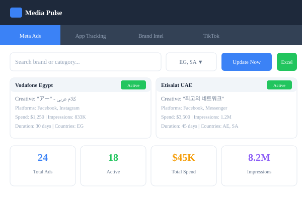
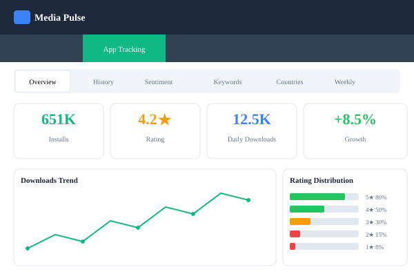
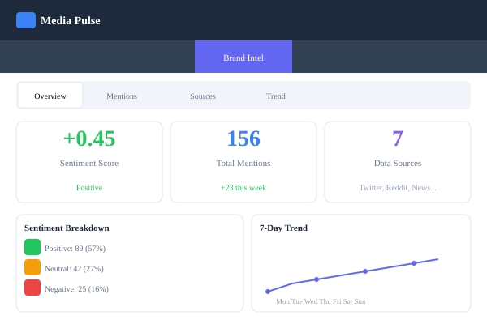
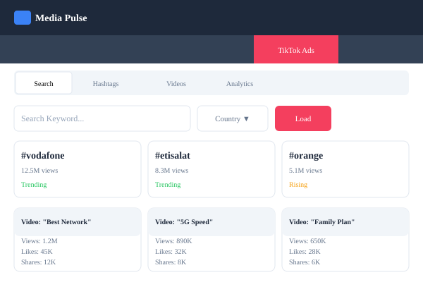
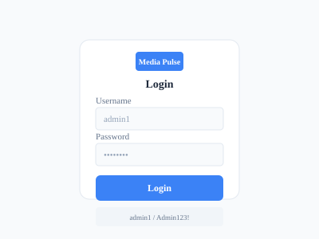

# Media Pulse — منصة ذكية لشراء الإعلانات

[](https://opensource.org/licenses/MIT)

> **عربي:** منصة متكاملة لتتبع الإعلانات والمنافسين وتحليل المشاعر مع دعم كامل للعربية والإنجليزية
>
> **English:** A comprehensive platform for tracking competitor ads, analyzing sentiment, and optimizing media buying strategies with full Arabic/English support

---

## 🔗 Live Demo / روابط التجربة

| المكون / Component | الرابط / URL |
|-------------------|--------------|
| **Landing Page** | [media-pulse-landing.vercel.app](https://media-pulse-landing.vercel.app) |
| **Frontend Demo** | [media-pulse-six.vercel.app](https://media-pulse-six.vercel.app) |
| **Backend API** | [media-pulse-production.up.railway.app](https://media-pulse-production.up.railway.app) |
| **API Docs** | [media-pulse-production.up.railway.app/docs](https://media-pulse-production.up.railway.app/docs) |

**بيانات الدخول / Demo Credentials:** `admin1` / `Admin123!`

---

## ✨ المميزات / Features

| الميزة | English | الوصف |
|--------|---------|-------|
| 📊 Meta Ad Library | Meta Ad Library Monitoring | تتبع إعلانات المنافسين على Facebook, Instagram, Messenger |
| 📱 App Tracking | App Store & Google Play Tracking | تتبع التحميلات الدقيقة والتقييمات والترتيب |
| 💬 Sentiment Analysis | AI-powered Sentiment Analysis | تحليل المشاعر باستخدام VADER + TextBlob + NRCLex |
| 🔑 ASO Keywords | ASO Keywords Generation | توليد كلمات مفتاحية محسّنة لرؤية أفضل |
| 🌍 Country Analytics | Country Analytics | تتبع الأداء في مصر ودول الخليج |
| 🎵 TikTok Integration | TikTok Integration | تحليل الهاشتاجات الرائجة والأداء الإعلاني |
| 🌐 Bilingual Support | Bilingual (AR/EN) | دعم كامل للعربية والإنجليزية مع RTL |
| 🔐 Role-based Auth | Role-based Authentication | مصادقة بالأدوار (admin, analyst, viewer) |

---

## 🏗️ Architecture / الهيكل

### System Diagram

```
┌─────────────────────────────────────────────────────────────┐
│                        Users                                 │
└─────────────────────────┬───────────────────────────────────┘
                          │
                          ▼
┌─────────────────────────────────────────────────────────────┐
│                    Landing Page                              │
│                  (media-pulse-landing.vercel.app)            │
└─────────────────────────┬───────────────────────────────────┘
                          │
                          ▼
┌─────────────────────────────────────────────────────────────┐
│                      Frontend                                │
│                  (media-pulse-six.vercel.app)                │
│                     React + Vite                             │
└─────────────────────────┬───────────────────────────────────┘
                          │
                          ▼
┌─────────────────────────────────────────────────────────────┐
│                      Backend API                             │
│            (media-pulse-production.up.railway.app)           │
│                    FastAPI + Python                          │
└─────────────────────────┬───────────────────────────────────┘
                          │
                          ▼
┌─────────────────────────────────────────────────────────────┐
│                      Database                                │
│                  (Supabase PostgreSQL)                       │
└─────────────────────────────────────────────────────────────┘
```

---

## 🛠️ Tech Stack / التقنيات

### Backend

| التقنية | English | الوصف |
|---------|---------|-------|
| FastAPI | FastAPI Framework | Framework بديل سريع للـ API |
| Uvicorn | Uvicorn Server | Server ASGI |
| SQLAlchemy | SQLAlchemy ORM | ORM للتعامل مع الداتابيز |
| PostgreSQL | PostgreSQL (Supabase) | الداتابيز السحابية |
| VADER | VADER Sentiment | تحليل المشاعر القائم على القواعد |
| TextBlob | TextBlob | تحليل المشاعر |
| NRCLex | NRCLex | تحليل المشاعر المبني على NRCLex |
| Groq | Groq LLM | نموذج الذكاء الاصطناعي |
| DuckDuckGo | DuckDuckGo Search | بحث الويب |

### Frontend

| التقنية | English | الوصف |
|---------|---------|-------|
| React 18 | React 18 | مكتبة بناء الواجهات |
| TypeScript | TypeScript | لغة برمجة آمنة |
| Vite | Vite | أداة بناء سريعة |
| TailwindCSS 4 | TailwindCSS 4 | إطار عمل CSS |
| Recharts | Recharts | مكتبة الرسوم البيانية |
| i18n | Internationalization | دعم اللغة |

### Deployment

| المكون | English | الخدمة |
|--------|---------|--------|
| Backend | Backend Hosting | Railway |
| Frontend | Frontend Hosting | Vercel |
| Database | Database Hosting | Supabase PostgreSQL |

---

## 📡 API Endpoints / واجهات برمجة التطبيقات

### Health & Config

| Method | Endpoint | الوصف |
|--------|----------|-------|
| GET | `/api/health` | فحص صحة النظام |
| GET | `/api/supabase-config` | إعدادات Supabase |

### Authentication / المصادقة

| Method | Endpoint | الوصف |
|--------|----------|-------|
| POST | `/api/auth/login` | تسجيل الدخول |
| GET | `/api/auth/me` | معلومات المستخدم الحالي |

### User Management / إدارة المستخدمين

| Method | Endpoint | الوصف |
|--------|----------|-------|
| GET | `/api/users` | قائمة المستخدمين |
| POST | `/api/users` | إضافة مستخدم جديد |

### Regions & Countries / المناطق والدول

| Method | Endpoint | الوصف |
|--------|----------|-------|
| GET | `/api/regions` | قائمة المناطق |
| GET | `/api/countries` | قائمة الدول |

### Keywords / الكلمات المفتاحية

| Method | Endpoint | الوصف |
|--------|----------|-------|
| GET | `/api/keywords/{brand_name}` | كلمات مفتاحية للبراند |
| POST | `/api/keywords/custom` | إضافة كلمات مفتاحية مخصصة |

### Ad Library / مكتبة الإعلانات

| Method | Endpoint | الوصف |
|--------|----------|-------|
| POST | `/api/ads/preview` | معاينة الإعلانات |
| POST | `/api/ads/search` | بحث في الإعلانات |
| GET | `/api/ads` | قائمة الإعلانات |
| GET | `/api/pages/search` | بحث في الصفحات |
| GET | `/api/jobs` | قائمة المهام |
| GET | `/api/export/ads` | تصدير الإعلانات |
| GET | `/api/stats/{brand_name}` | إحصائيات البراند |

### App Tracking / تتبع التطبيقات

| Method | Endpoint | الوصف |
|--------|----------|-------|
| POST | `/api/apps/search` | بحث في التطبيقات |
| POST | `/api/apps/track` | تتبع تطبيق |
| GET | `/api/apps` | قائمة التطبيقات |
| GET | `/api/apps/trending` | التطبيقات الرائجة |
| GET | `/api/apps/categories` | التصنيفات |
| GET | `/api/apps/category/{category}` | تطبيقات التصنيف |
| POST | `/api/apps/compare` | مقارنة التطبيقات |
| GET | `/api/apps/{tracked_id}` | تفاصيل التطبيق |
| POST | `/api/apps/{tracked_id}/refresh` | تحديث التطبيق |
| GET | `/api/apps/{tracked_id}/history` | تاريخ التطبيق |
| DELETE | `/api/apps/{tracked_id}` | حذف التطبيق |
| GET | `/api/apps/{tracked_id}/sentiment` | تحليل مشاعر التطبيق |
| GET | `/api/apps/{tracked_id}/rank` | ترتيب التطبيق |
| GET | `/api/apps/{tracked_id}/keywords` | كلمات مفتاحية للتطبيق |
| GET | `/api/apps/{tracked_id}/countries` | دول التطبيق |
| GET | `/api/apps/{tracked_id}/weekly` | إحصائيات أسبوعية |

### TikTok

| Method | Endpoint | الوصف |
|--------|----------|-------|
| GET | `/api/tiktok/ads/search` | بحث إعلانات TikTok |
| GET | `/api/tiktok/trending/hashtags` | الهاشتاجات الرائجة |
| GET | `/api/tiktok/trending/videos` | الفيديوهات الرائجة |
| GET | `/api/tiktok/ad/{material_id}` | تفاصيل الإعلان |
| GET | `/api/tiktok/industries` | الصناعات |
| GET | `/api/tiktok/countries` | الدول |

### Brand Intelligence / استخبارات البراند

| Method | Endpoint | الوصف |
|--------|----------|-------|
| GET | `/api/brand/sources` | مصادر البيانات |
| GET | `/api/brand/{brand_name}/sentiment` | تحليل مشاعر البراند |
| GET | `/api/brand/{brand_name}/mentions` | ذكر البراند |
| GET | `/api/brand/{brand_name}/trend` | اتجاه البراند |

### Correlation & ROI

| Method | Endpoint | الوصف |
|--------|----------|-------|
| GET | `/api/correlation/{tracked_id}` | تحليل الارتباط |
| GET | `/api/correlation/{tracked_id}/roi` | العائد على الاستثمار |
| GET | `/api/correlation/{tracked_id}/attribution` | إسناد الحملات |
| GET | `/api/correlation/brand/{brand_name}` | ارتباط البراند |

---

## 🗄️ Database Schema / مخطط قاعدة البيانات

### Models / النماذج

| النموذج | English | الوصف |
|---------|---------|-------|
| User | User | المستخدمون |
| Region | Region | المناطق |
| Country | Country | الدول |
| Brand | Brand | البراندات |
| Keyword | Keyword | الكلمات المفتاحية |
| Ad | Ad | الإعلانات |
| AppTracked | App Tracked | التطبيقات المتعقبة |
| AppSnapshot | App Snapshot | لقطات التطبيقات |
| ScrapeJob | Scrape Job | مهام الجمع |
| Settings | Settings | الإعدادات |

---

## 📱 Frontend Pages / صفحات الواجهة

### 1. AdLibrary.tsx — مكتبة الإعلانات



**الميزات:**
- Search by brand
- Filter by country (EG/GCC)
- Export to Excel
- Stats dashboard

### 2. AppTracking.tsx — تتبع التطبيقات



**الميزات:**
- 6 tabs (Overview, History, Sentiment, Keywords, Countries, Weekly)
- Exact install numbers
- Rating tracking
- Growth charts

### 3. BrandIntelligence.tsx — استخبارات البراند



**الميزات:**
- 4 tabs (Overview, Mentions, Sources, Trend)
- Multi-source sentiment
- Provider selection
- Trend visualization

### 4. TikTokAds.tsx — إعلانات تيك توك



**الميزات:**
- 4 sub-tabs (Search, Hashtags, Videos, Analytics)
- Trending content
- Ad analytics
- Material ID lookup

### 5. Login.tsx — تسجيل الدخول



**الميزات:**
- Username/password form
- Demo credentials display
- Error handling

---

## 🔐 Security / الأمان

### Authentication / المصادقة

- JWT tokens (24h expiry)
- Password hashing (bcrypt)
- Role-based access control

### User Roles / أدوار المستخدمين

| الدور | English | الصلاحيات |
|-------|---------|-----------|
| admin | Admin | Full access |
| analyst | Analyst | Analysis access |
| viewer | Viewer | Read-only |

### Demo Users / يوزرز التجربة

| Username | Password | Role |
|----------|----------|------|
| admin1 | Admin123! | admin |
| admin2 | Admin123! | admin |
| analyst1 | Analyst123! | analyst |
| viewer1 | Viewer123! | viewer |
| viewer2 | Viewer123! | viewer |

---

## 🚀 Deployment / النشر

### Backend (Railway)

```bash
cd backend
pip install -r requirements.txt
uvicorn main:app --host 0.0.0.0 --port $PORT
```

### Frontend (Vercel)

```bash
cd frontend
npm run build
# Output: dist/
```

### Environment Variables / متغيرات البيئة

```
DATABASE_URL=postgresql://...
SUPABASE_URL=https://...
META_ACCESS_TOKEN=...
JWT_SECRET=...
```

---

## 🧪 Testing / الاختبارات

### Backend Tests (13 files)

- test_api.py
- test_auth.py
- test_base_scraper.py
- test_brand_sentiment.py
- test_correlation.py
- test_google_scraper.py
- test_integration.py
- test_rss_scraper.py
- test_scraper_factory.py
- test_tiktok.py

### Frontend Tests

- client.test.ts

---

## 🌍 Countries / الدول المدعومة

| الدولة | English | الرمز |
|--------|---------|-------|
| 🇪🇬 مصر | Egypt | EG |
| 🇸🇦 السعودية | Saudi Arabia | SA |
| 🇦🇪 الإمارات | UAE | AE |
| 🇶🇦 قطر | Qatar | QA |
| 🇰🇼 الكويت | Kuwait | KW |
| 🇧🇭 البحرين | Bahrain | BH |
| 🇴🇲 عُمان | Oman | OM |

---

## 📁 Project Structure / هيكل المشروع

```
media-pulse/
├── backend/                    # FastAPI Backend
│   ├── main.py                 # API routes
│   ├── models.py               # SQLAlchemy models
│   ├── crud.py                 # Database operations
│   ├── services/               # Business logic
│   │   ├── auth.py             # JWT authentication
│   │   ├── brand_sentiment.py  # Sentiment analysis
│   │   ├── playstore.py        # Google Play scraper
│   │   ├── tiktok.py           # TikTok integration
│   │   └── scrapers/           # Multi-source scrapers
│   ├── tests/                  # 13 test files
│   └── requirements.txt
├── frontend/                   # React + Vite
│   ├── src/
│   │   ├── pages/              # 5 main pages
│   │   ├── components/         # Shared components
│   │   ├── api/                # API client
│   │   └── i18n/               # Translations (AR/EN)
│   └── package.json
├── landing/                    # Landing page
│   ├── index.html
│   ├── styles.css
│   └── script.js
├── docs/screenshots/           # SVG Mockups
├── docker-compose.yml
└── README.md
```

---

## 📊 Statistics / الإحصائيات

| Metric | Value |
|--------|-------|
| Backend Services | 15 files |
| Frontend Pages | 5 pages |
| Database Models | 10 models |
| API Endpoints | 47 endpoints |
| Test Files | 13 files |
| i18n Languages | 2 (AR/EN) |
| Supported Countries | 7 |
| Demo Users | 5 |
| Git Commits | 11 |

---

## 📝 License / الترخيص

MIT License — feel free to use for your projects.

---

## 🤝 Contributing / المساهمة

Contributions welcome! Please open an issue or PR.

---

## 📧 Contact / التواصل

For questions or support, open an issue on GitHub.
